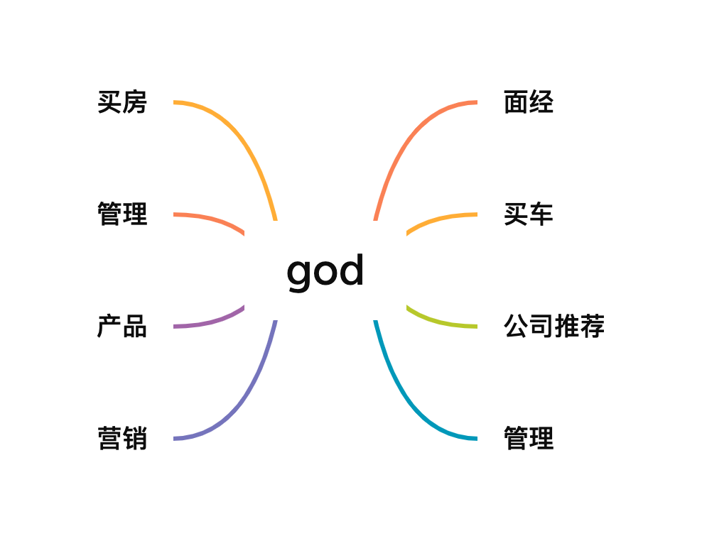

<!--
 * @Author: shgopher shgopher@gmail.com
 * @Date: 2023-01-06 20:01:53
 * @LastEditors: shgopher shgopher@gmail.com
 * @LastEditTime: 2023-01-06 20:02:25
 * @FilePath: /god/README.md
 * @Description: 
 * 
 * Copyright (c) 2023 by shgopher shgopher@gmail.com, All Rights Reserved. 
-->

hey~，我是科科人神，目前就职于国内一家互联网公司，你们可以加我<a href="#wechat.png">微信</a>，交个朋友吧~

 

添加微信公众号：<a href="#wechat.png">科科人神</a>, 回复：

- `思维导图`, 获取作者总结的超详细的找工作面试秘籍，知识超级全面，并且以思维导图的方式更容易多维立体记忆。
- `面试题`, 获取经典go面试大全。

- `好友`, 可以添加作者的微信好友

                             
## 系列教程
- [GOFamily](https://github.com/shgopher/GOFamily/) 一本为go后端程序员打造的教程
- [408](https://github.com/shgopher/408/) 一本主要以408知识为主的基础课程
- [luban](https://github.com/shgopher/luban/) 一本用鲁班的名字命名，主要讲解系统设计的书籍
- [dingdang](https://github.com/shgopher/dingdang/) 叮当，是一本讲解各种工具的书
- [god](https://github.com/shgopher/god/) 给程序员写的教程，主要关于学习，副业，买房，面试等内容，程序员才是真神！
## 推荐项目
- [hui](https://github.com/shgopher/hui) 一个简洁好用效率高的web框架
- [key](https://github.com/shgopher/key) 一个服务授权系统
- [go-short](https://github.com/shgopher/go-short) 一个超级好用的短链接服务
- [ka](https://github.com/shgopher/ka) 一个效率非常高的秒杀服务                               
## 赚钱
- [李杰灵的创业之路](./%E8%B5%9A%E9%92%B1/创业经验/李杰灵.md)
## 面试
- [优秀面试题总结](./面经/优秀的面试题总结.md)
- [面经-阿里巴巴-后端-大获成功](./面经/阿里巴巴/面经一/READMD.md) 
- [面试官自述-百度-后端](./面经/百度/面试官自述一/README.md)
## 管理
## 晋升
## 公司推荐
- [北京](./公司推荐/北京)
- [上海](./公司推荐/上海)
- [955公司](https://github.com/formulahendry/955.WLB)

## 视频教程
- [x] [《go语言从入门到实践》](https://github.com/shgopher/bestGO)
## 系列教程
- [x] [GOFamily](https://github.com/shgopher/GOFamily/) 一本为go后端程序员打造的教程
- [ ] [RustFamily](https://github.com/shgopher/RustFamily) 一本为rust后端程序员打造的教程
- [x] [408](https://github.com/shgopher/408/) 一本主要以408知识为主的基础课程
- [x] [luban](https://github.com/shgopher/luban/) 一本用鲁班的名字命名，主要讲解系统设计的书籍
- [x] [dingdang](https://github.com/shgopher/dingdang/) 叮当，是一本讲解各种工具的书
- [x] [god](https://github.com/shgopher/god/) 给程序员写的教程，主要关于学习，副业，买房，面试等内容，程序员才是真神！
## 作者写的项目
- [ ] [hui](https://github.com/shgopher/hui) 一个简洁好用效率高的web框架
- [ ] [zhongli](https://github.com/shgopher/zhongli) 一个高效易用的 rpc 框架
- [ ] [yelan](https://github.com/shgopher/yelan) 一个利用k8s基本原理去写的区块链服务
- [ ] [retuo](https://github.com/shgopher/retuo) 一个分布式爬虫服务
- [ ] [ka](https://github.com/shgopher/ka) 一个效率非常高的秒杀服务
- [ ] [key](https://github.com/shgopher/key) 一个微服务架构的服务授权系统
- [x] [short](https://github.com/shgopher/short) 一个简单的短链接服务
- [ ] [go-short](https://github.com/shgopher/go-short) 一个微服务架构的短链接服务

## 参考资料
                                                                           
## star
                                                                             

